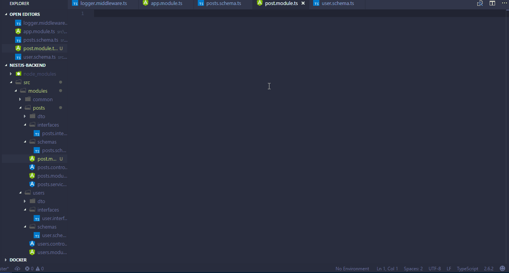

### vscode-nestjs-snippets

<h1 style="text-align: center;">NESTJS SNIPPETS FOR VSCODE</h1>

This extension adds snippets for working with nestjs in Vscode

## Screenshot

## Usage

| Snippet                      | Purpose                                   |
|------------------------------|--------------------------------------     |
| `nsjs-con`                   | NestJS Controller                         |
| `nsjs-mid`                   | NestJS Middleware                         |
| `nsjs-mod`                   | NestJS Module                             |
| `nsjs-mod-root`              | NestJS Root Module                        |
| `nsjs-mod-nest`              | NestJS Module Implementing NestModule     |
| `nsjs-ser-mon`               | NestJS Service for Mongoose               |
| `nsjs-mon-int`               | NestJS Interface for mongoose             |
| `nsjs-unit-test`             | NestJS Unit Test                          |

## Installation

1. Install Visual Studio Code 1.10.0 or higher
1. Launch Code
1. From the command palette `Ctrl`-`Shift`-`P` (Windows, Linux) or `Cmd`-`Shift`-`P` (OSX)
1. Select `Install Extension`
1. Choose the extension
1. Reload Visual Studio Code

## Contributing

Contributions are highly welcome

## Release Notes

### 0.0.2
Pre release of vscode-nestjs-snippets